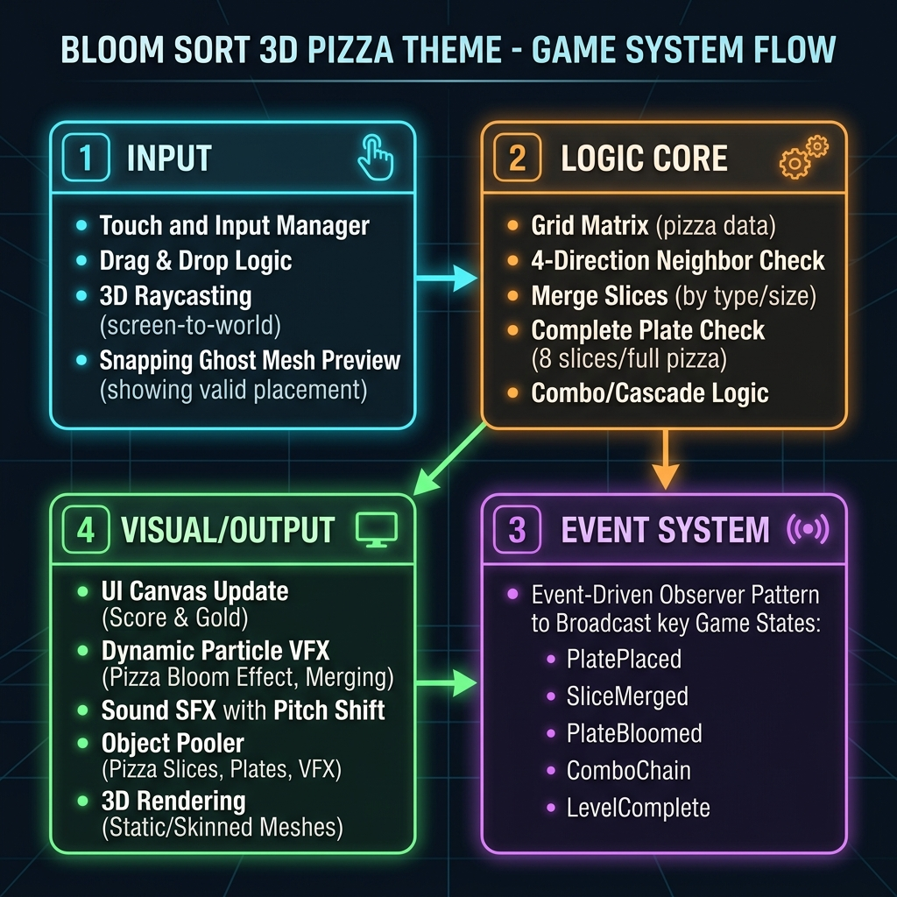

# Dự án 1: Core Gameplay Bloom Sort 3D (Chủ đề Pizza)

- **Vị trí thực hiện:** Unity Developer (Dự án Solo)
- **Thời gian thực hiện:** 18/05/2026 - 14/06/2026
- **Công nghệ sử dụng:** Unity Engine, C# Scripting, Event-driven Architecture, FSM State Machine.

---

## 1. Sơ đồ hoạt động hệ thống (System Flow Diagram)



---

## 2. Mô tả luồng vận hành chính

Hệ thống được xây dựng tách biệt hoàn toàn giữa logic tính toán xử lý dữ liệu và phần hiển thị hình ảnh/âm thanh thông qua kiến trúc hướng sự kiện (Event-driven / Observer Pattern):

- **Khối Đầu Vào (Input - DragAndDrop.cs):** Tiếp nhận tương tác kéo thả đĩa bánh của người chơi. Sử dụng Raycast phát hiện ô lưới tương thích, tự động hút nhẹ (Snap) và hiển thị mô hình xem trước bán trong suốt (Preview Ghost Mesh).
- **Khối Logic Cốt Lõi (Logic Core - GridManager.cs, PizzaPlate.cs):** Quản lý ma trận lưới chơi, thực hiện thuật toán quét 4 hướng lân cận tìm cặp trùng vị trí. Thực hiện dịch chuyển các lát bánh pizza thông qua đường cong Bezier và xử lý chuỗi nổ liên hoàn (Combo Cascade) khi đĩa đạt đủ 6 miếng pizza cùng vị.
- **Khối Truyền Tin (Event System - GameEvents.cs):** Đóng vai trò trung gian truyền phát tín hiệu, giúp giảm thiểu sự phụ thuộc trực tiếp (Tight Coupling) giữa các lớp nhân tố trong mã nguồn.
- **Khối Đầu Xuất (Visual/Output - UIManager.cs, AudioManager.cs, ObjectPooler.cs):** Nhận tín hiệu từ Khối truyền tin để cập nhật giao diện Canvas độc lập, kích hoạt hiệu ứng âm thanh tăng tiến cao độ (Pitch Shift) và tái sử dụng các hiệu ứng nổ pháo hoa hạt và text điểm nổi từ Object Pool.

---

## 3. Hệ thống Máy Trạng Thái FSM (State Pattern)

Nhằm quản lý các trạng thái chơi game một cách chặt chẽ và dễ dàng mở rộng, dự án áp dụng mẫu thiết kế **State Pattern** thông qua interface `IGameState`. Mỗi trạng thái là một class độc lập tự quản lý logic của riêng mình:

1. **Setup State (`SetupState`):** Khởi tạo bàn chơi và cấu hình lưới chơi từ file JSON, chờ Grid và Spawner hoàn tất khởi động.
2. **Playing State (`PlayingState`):** Cho phép người chơi thực hiện kéo thả và tương tác với đĩa bánh. Đồng hồ đếm ngược Combo hoạt động ở trạng thái này.
3. **Checking Combo State (`CheckingComboState`):** Kích hoạt sau khi đĩa bánh được đặt xuống hoặc sau một lượt merge hoàn tất. Logic sẽ tự động quét lưới tìm các cặp bánh có thể gộp và thực hiện merge.
4. **Animating State (`AnimatingState`):** Chặn toàn bộ tương tác kéo thả của người chơi khi các lát bánh pizza đang bay trên không hoặc đang chạy hoạt cảnh nổ Bloom Sort. Đồng hồ combo vẫn đếm để giữ chuỗi liên hoàn.
5. **GameOver State (`GameOverState`):** Kích hoạt khi lưới chơi đầy 100% và không còn bất kỳ cặp bánh lân cận nào cùng vị có thể merge được.

---

## 4. Hướng dẫn cấu hình dữ liệu JSON (Data-Driven Design)

Hệ thống được thiết kế theo hướng Data-driven, cho phép tùy chỉnh thông số game mà không cần can thiệp hay sửa đổi mã nguồn.

### 4.1 Cấu hình Lưới chơi (`LevelConfig.json`)
Nằm tại thư mục `Assets/Resources/LevelConfig.json`. Dùng để cấu hình kích thước bàn chơi động:
```json
{
  "gridWidth": 3,
  "gridHeight": 3,
  "cellSize": 1.5
}
```
*Ý nghĩa các thông số:*
- `gridWidth`: Số lượng ô lưới theo chiều ngang (trục X).
- `gridHeight`: Số lượng ô lưới theo chiều dọc (trục Z).
- `cellSize`: Kích thước của mỗi ô lưới và khoảng cách giữa các ô. Hệ thống tự động tính toán Offset căn tâm lưới về chính giữa bàn chơi gỗ.

### 4.2 Cấu hình Cửa hàng (`shop_config.json`)
Nằm tại thư mục `Assets/Resources/shop_config.json`. Dùng để cấu hình các đĩa bánh bán trong shop:
```json
{
    "skins": [
        {
            "skinId": "Default",
            "displayName": "Đĩa sứ trắng (Mặc định)",
            "price": 0,
            "description": "Đĩa sứ trắng tinh khôi, miễn phí cho mọi người chơi."
        },
        {
            "skinId": "Clay",
            "displayName": "Đĩa đất sét (Clay)",
            "price": 50,
            "description": "Đĩa thủ công bằng đất sét đỏ, mộc mạc và chắc chắn."
        }
    ]
}
```
*Ý nghĩa các thông số:*
- `skinId`: Định danh duy nhất của skin đĩa bánh (phải khớp với tên model/texture tương ứng trong Resources).
- `displayName`: Tên hiển thị trên giao diện UI Shop.
- `price`: Giá vàng cần trả để mở khóa đĩa.
- `description`: Mô tả chi tiết về nguồn gốc, thiết kế của đĩa bánh.

---

## 5. Các Kỹ Thuật Tối Ưu Hóa Hiệu Năng (Tuần 4)

Dự án đã trải qua chu kỳ tối ưu hóa toàn diện để đạt hiệu năng mượt mà trong thời gian dài chơi game:

### 5.1 Tách biệt UI Canvas Tĩnh và Động
- **Vấn đề:** Thay đổi text điểm số hoặc vàng liên tục mỗi giây sẽ bắt buộc Unity phải vẽ lại (Rebuild) toàn bộ Mesh của cả Canvas, bao gồm cả các nút bấm tĩnh, thanh nền và khung ảnh.
- **Giải pháp:** Tách Canvas UI chính thành Canvas Tĩnh (`StaticCanvasPanel`) và Canvas Động (`DynamicCanvasPanel`) độc lập thông qua việc đính kèm thành phần `Canvas` riêng lẻ trên các nhóm con. Canvas Tĩnh được đính kèm thêm `GraphicRaycaster` riêng để tiếp nhận tương tác nút bấm, giúp triệt tiêu hoàn toàn Canvas Rebuild dư thừa trên các thành phần tĩnh khi điểm số thay đổi liên tiếp.

### 5.2 Cấu hình GPU Instancing cho Assets 3D
- **Giải pháp:** Kích hoạt thuộc tính `m_EnableInstancingVariants: 1` trực tiếp bên trong các tệp cấu hình vật liệu `.mat` (gồm `plate.mat`, `TableZasiki_dif.mat`, `lobby.mat`). Điều này cho phép Unity tự động gom toàn bộ các đĩa bánh 3D giống nhau trên lưới và vẽ chúng chỉ trong một lần gửi lệnh vẽ (Draw Call) duy nhất nhờ GPU Instancing của Universal Render Pipeline (URP).

### 5.3 Cache đối tượng trạng thái (State Caching)
- **Vấn đề:** Việc gọi `new SetupState()`, `new PlayingState()` mỗi lần thay đổi trạng thái gây ra việc cấp phát bộ nhớ liên tục trong phân vùng Heap, làm kích hoạt bộ dọn rác GC thu dọn tài nguyên gây khựng khung hình (FPS Drop).
- **Giải pháp:** Tạo sẵn các đối tượng trạng thái FSM trong một Dictionary cache ngay tại hàm `Awake` của `GameManager`. Quá trình chuyển trạng thái chỉ đơn giản là trích xuất tham chiếu từ cache, giảm thiểu GC Alloc về mức 0 khi vận hành FSM.

### 5.4 Tối ưu hóa Object Pool & Chia sẻ Vật liệu static
- **Pre-Allocation**: Tăng dung lượng khởi tạo mặc định của pool hiệu ứng nổ và chữ nổi lên `32` đối tượng. Đảm bảo trong quá trình xảy ra combo nổ lớn, game hoàn toàn tái sử dụng các đối tượng cũ và không phải Instantiate động giữa chừng.
- **Shared Particle Materials**: Trong class điều khiển hạt nổ `FallbackExplosionVFX`, thay vì tạo vật liệu mới `new Material(unlitShader)` cho mỗi viên hạt của từng vụ nổ (gây rò rỉ hàng trăm vật liệu trong bộ nhớ và tăng Draw Call), dự án thiết lập một mảng tĩnh chứa sẵn 8 màu HSL. Toàn bộ các vụ nổ và các hạt sẽ gán chung thông qua `mr.sharedMaterial`. Điều này giúp triệt tiêu hoàn toàn GC Alloc khi nổ lớn, sửa triệt để lỗi rò rỉ bộ nhớ material, và cho phép Unity tối ưu hóa Dynamic Batching/GPU Instancing cho hạt nổ.
- **Shared Ghost Material**: Áp dụng cơ chế chia sẻ vật liệu tĩnh `_sharedGhostMaterial` cho toàn bộ các đĩa preview bán trong suốt của class `DragAndDrop`, loại bỏ rác thải Heap khi người chơi thực hiện nhấc đĩa bánh lên liên tục.

### 5.5 Kiểm soát Lỗi & Lập trình Phòng thủ
- Thêm kiểm tra điều kiện biên `slot == null` trong các phương thức truy vấn ma trận lưới chơi tại `GridManager.cs` để ngăn lỗi `ArgumentNullException` và `NullReferenceException` phát sinh trong các chu kỳ quét combo.
- Dọn dẹp an toàn các Mesh xem trước của kéo thả trong hàm `OnDestroy` để tránh sinh rác bộ nhớ rỗng trong cảnh chơi.
